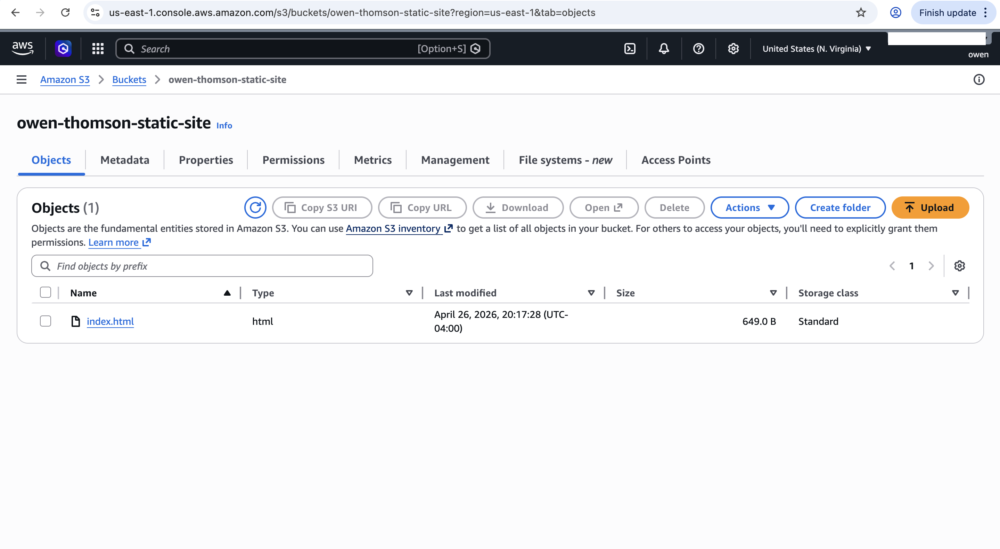
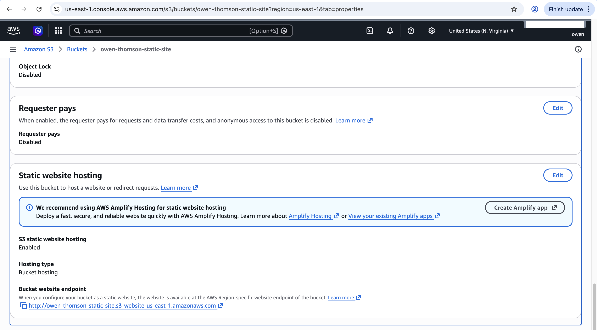
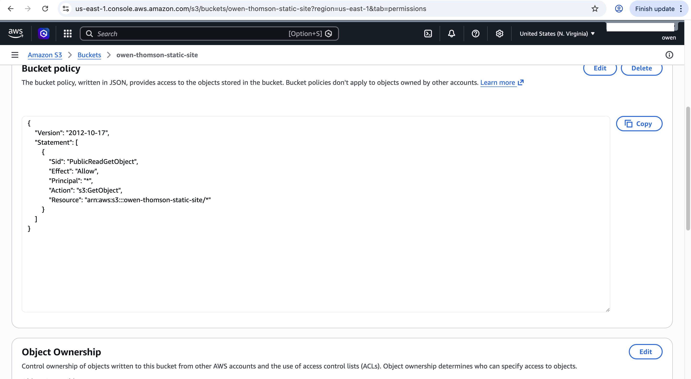
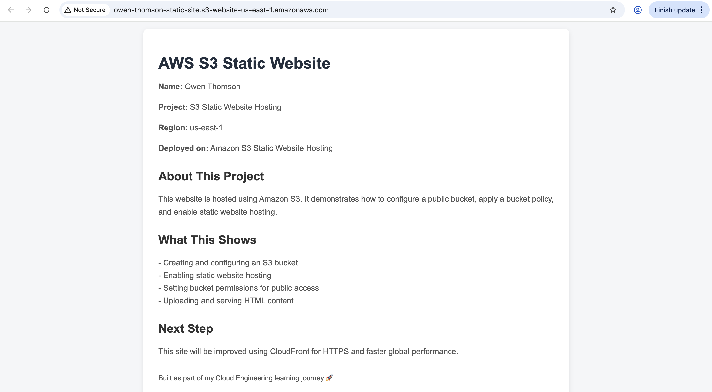
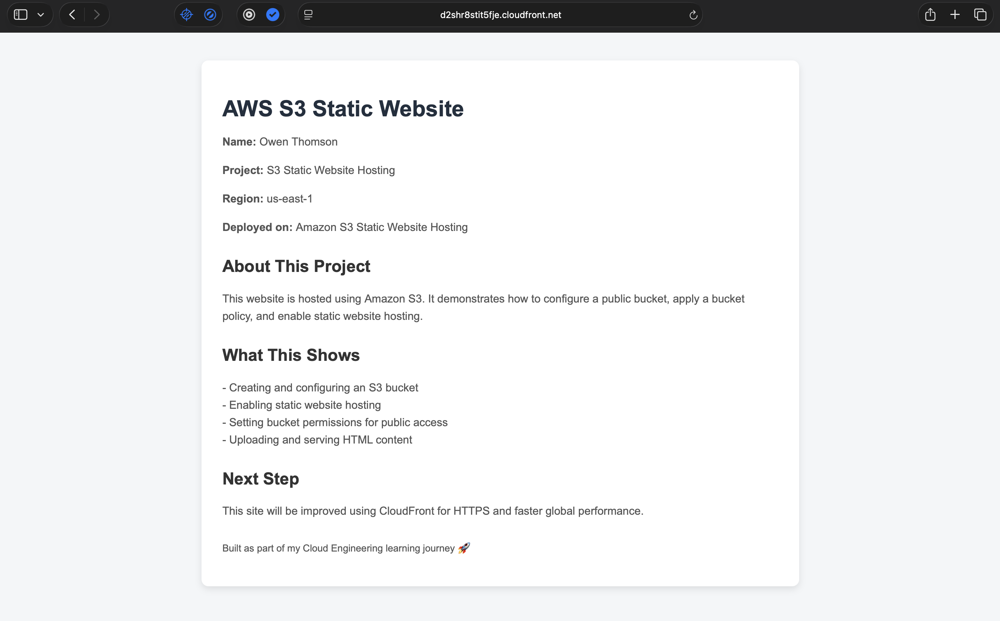
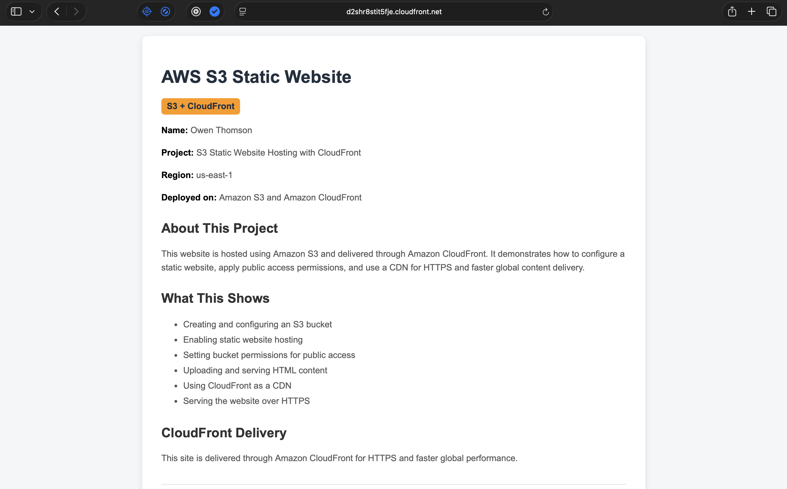

# AWS S3 Static Website with CloudFront

> Static website hosted on Amazon S3 and delivered through Amazon CloudFront.

---

## Overview

This project demonstrates how to host a static website using Amazon S3 and deliver it through Amazon CloudFront.

I created an S3 bucket, uploaded a custom `index.html` file, enabled static website hosting, configured a bucket policy for public access, and then used CloudFront to deliver the website through a CDN.

The AWS resources were cleaned up after testing to avoid unnecessary charges.

---

## Architecture

- Amazon S3
- S3 Static Website Hosting
- S3 Bucket Policy
- Amazon CloudFront
- HTML
- CSS
- AWS Management Console

---

## Features

- Static website hosted using Amazon S3
- Public website endpoint configured
- Bucket policy applied for public object access
- Custom HTML page created in VS Code
- CloudFront distribution created
- Website delivered through CloudFront
- CloudFront cache invalidation used after updating website content

---

## How It Works

1. An `index.html` file was created locally in VS Code.
2. The file was uploaded to an S3 bucket.
3. Static website hosting was enabled on the bucket.
4. A bucket policy allowed public read access to the website file.
5. The S3 website endpoint was tested in the browser.
6. A CloudFront distribution was created using the S3 website endpoint as the origin.
7. CloudFront delivered the website through its distribution domain.
8. A CloudFront invalidation was used after updating the website content.

---

## Screenshots

### S3 Bucket Objects

---

### S3 Static Website Hosting

---

### S3 Bucket Policy

---

### S3 Website Endpoint

---

### CloudFront Distribution

---

### CloudFront Website

---

## What I Learned

- How to create and configure an S3 bucket
- How to enable static website hosting
- How to apply an S3 bucket policy
- How to upload and serve static website files
- How CloudFront can be used as a CDN
- How CloudFront caching works
- How to use CloudFront invalidations after updating website content
- Why cloud resources should be cleaned up after testing

---

## Project Files

- `index.html` — website source code
- `Screenshots/` — screenshots showing the AWS configuration and working website

---

## Why This Project Matters

This project demonstrates core cloud engineering skills including object storage, static hosting, access permissions, CDN delivery, caching, and AWS resource cleanup.

These are common concepts used when deploying lightweight websites, documentation pages, landing pages, and static front-end applications in AWS.
